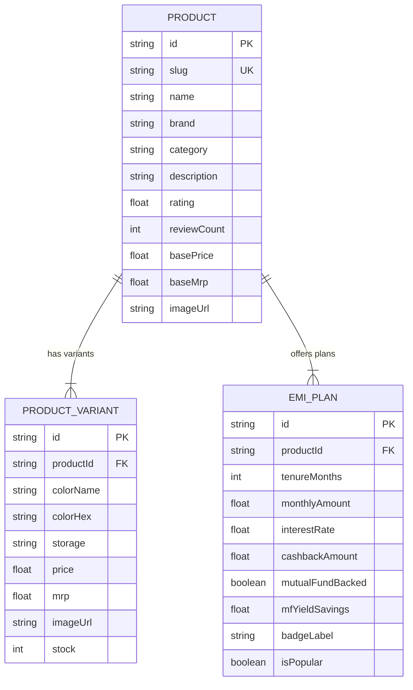

# 1Fi Marketplace — Mutual Fund Backed No-Cost EMI Platform

> **Full-Stack Implementation for the 1Fi SDE Intern Assignment**  
> A Next.js 14 web application extending the **1Fi Financial Marketplace**. Enables users to explore flagship electronics (smartphones, laptops) and purchase them on flexible 0% No-Cost EMI plans backed by their Mutual Fund investment portfolio.

---

## 🧭 Quick Navigation (Table of Contents)
- [🖥️ Key Application Showcase](#️-key-application-showcase)
- [⚡ Architectural Highlights & Core Features](#-architectural-highlights--core-features)
  - [1. 1Fi Storefront & Navigation Architecture](#1-1fi-storefront--navigation-architecture)
  - [2. Dynamic Product & Variant Engine](#2-dynamic-product--variant-engine)
- [💻 Technology Stack](#-technology-stack)
- [🗄️ Database Schema Overview](#%EF%B8%8F-database-schema-overview)
  - [Models & Field Specifications](#models--field-specifications)
- [🔗 API Reference & Endpoints](#-api-reference--endpoints)
  - [1. Fetch All Products](#1-fetch-all-products)
  - [2. Fetch Single Product Details](#2-fetch-single-product-details)
  - [3. Process Checkout Order](#3-process-checkout-order)
- [📦 Setup & Local Execution Guide](#-setup--local-execution-guide)
- [📋 Submission Checklist & Assignment Compliance](#-submission-checklist--assignment-compliance)

---

## 🖥️ Key Application Showcase

| 🏠 Home Dashboard (`/home`) | 🛒 Marketplace (`/`) | 📱 Product Detail (`/products/:slug`) |
| :---: | :---: | :---: |
| 1Fi Offers, Dual Marquee Loops, Timeline & FAQs | Top Brands, Nearby Stores & 1Fi Marketplace Grid | Multi-angle Gallery, Variants & Live EMI Engine |

| 💳 Limit Eligibility (`/limit`) | 👤 Profile View (`/profile`) | 🧾 EMI Dues (`/dues`) |
| :---: | :---: | :---: |
| 3D Floating Lock & Portfolio Check | Account Settings & Quick Action Cards | Active Loans & Monthly EMI Tracker |

---

## ⚡ Architectural Highlights & Core Features

### 1. 1Fi Storefront & Navigation Architecture
- **Home Dashboard (`/home`)**: Pixel-perfect implementation matching the official `app.1fi.in/dashboard`:
  - **Get Started Banner**: 0% Interest No-Cost EMI promo with 3D elements.
  - **Offers Slide**: Full-width scrollable deal cards (MakeMyTrip European Escape, Adventure Ride).
  - **Shop at Top Brands**: Infinite single-row marquee logo ticker loop.
  - **Why Pay With 1Fi**: Dual-direction infinite marquee loops (Left-to-Right & Right-to-Left).
  - **How 1Fi Works**: 3-Step timeline (*Connect Portfolio ➔ Unlock Limit ➔ Shop & Pay Later*).
  - **Refer and Earn**: Rewards banner with stylized 3D typography.
  - **Frequently Asked Questions**: Interactive accordion dropdown list for all 7 platform FAQs.
- **Shop Page (`/`)**: Features 3 selectable options:
  - **Top Brands**: Interactive brand offers catalog.
  - **Nearby Stores**: Store finder list with distance badges & address details.
  - **1Fi Marketplace**: Product grid with real-time search filtering, star ratings, discount tags, and top-corner 0% Interest EMI highlights.
- **Floating Bottom Navigation Bar**: Responsive navigation bar with active route indicators connecting `Home`, `Shop`, `EMI Dues`, `Limit`, and `Profile`.

### 2. Dynamic Product & Variant Engine
- **Product Detail Page (`/products/:slug`)**: Unique server routes for flagship products (Apple iPhone 17 Pro, Samsung Galaxy S24 Ultra, Apple MacBook Pro M5).
- **Variant State Synchronization**: Interactive color swatch and storage selector dynamically updating:
  - Multi-angle high-resolution thumbnail gallery.
  - Real-time price, original MRP, discount percentages, and available stock units.
- **Mutual Fund EMI Engine**: Dynamic tenure selector (3, 6, 9, 12, 24 months) showing monthly installment amounts, 0% interest rates, instant 1Fi wallet cashback, and estimated Mutual Fund yield return offsets.
- **Interactive Order Checkout Modal**: Complete flow simulating order placement, wallet cashback deposit, and Mutual Fund collateral pledging.

---

## 💻 Technology Stack

| Layer | Technology |
| :--- | :--- |
| **Framework** | Next.js 14 (App Router), React 18, TypeScript |
| **Styling & UI** | Tailwind CSS, Lucide Icons, Glassmorphism & Custom CSS Keyframe Animations |
| **Database & ORM** | Neon Serverless PostgreSQL with Prisma ORM |
| **API Architecture** | Node.js Serverless API Routes (`/api/products`, `/api/checkout`) |
| **Code Quality** | Strictly Typed (`tsc --noEmit` verified — 0 errors) |

---

## 🗄️ Database Schema Overview

Defined in [`prisma/schema.prisma`](prisma/schema.prisma):



### Models & Field Specifications

#### 1. `Product`
| Field | Type | Attributes | Description |
| :--- | :--- | :--- | :--- |
| `id` | `String` | `@id @default(uuid())` | Primary unique identifier |
| `slug` | `String` | `@unique` | URL parameter key (e.g. `iphone-17-pro`) |
| `name` | `String` | — | Full product name |
| `brand` | `String` | — | Brand name (e.g. `Apple`, `Samsung`) |
| `category` | `String` | — | Category classification |
| `description` | `String` | — | Technical description |
| `rating` | `Float` | — | Average customer review rating |
| `reviewCount` | `Int` | — | Total review count |
| `basePrice` | `Float` | — | Base price starting amount |
| `baseMrp` | `Float` | — | Maximum retail price (MRP) |
| `imageUrl` | `String` | — | Main display image asset path |

#### 2. `ProductVariant`
| Field | Type | Attributes | Description |
| :--- | :--- | :--- | :--- |
| `id` | `String` | `@id @default(uuid())` | Primary key |
| `productId` | `String` | `@relation` | Foreign key referencing `Product.id` |
| `colorName` | `String` | — | Variant color name (e.g. `Deep Titanium`) |
| `colorHex` | `String` | — | Hex code for color swatch rendering |
| `storage` | `String` | — | Storage capacity (e.g. `256 GB`) |
| `price` | `Float` | — | Selling price for variant |
| `mrp` | `Float` | — | Variant MRP |
| `imageUrl` | `String` | — | Multi-angle thumbnail image path |
| `stock` | `Int` | — | Available stock units |

#### 3. `EmiPlan`
| Field | Type | Attributes | Description |
| :--- | :--- | :--- | :--- |
| `id` | `String` | `@id @default(uuid())` | Primary key |
| `productId` | `String` | `@relation` | Foreign key referencing `Product.id` |
| `tenureMonths` | `Int` | — | Installment duration in months |
| `monthlyAmount` | `Float` | — | Monthly installment calculation |
| `interestRate` | `Float` | — | Interest rate percentage (`0` for No-Cost) |
| `cashbackAmount` | `Float` | — | Wallet instant cashback reward |
| `mutualFundBacked` | `Boolean` | — | MF collateral status flag |
| `mfYieldSavings` | `Float` | — | Estimated mutual fund return offset |
| `badgeLabel` | `String?` | Optional | Highlight tag (e.g. `0% Interest`) |
| `isPopular` | `Boolean` | — | Recommended plan indicator |

---

## 🔗 API Reference & Endpoints

### 1. Fetch All Products
```http
GET /api/products
```
Returns complete catalog including variant options and associated EMI plan models.

### 2. Fetch Single Product Details
```http
GET /api/products/:slug
```
Returns complete details for a specific product by slug (e.g. `/api/products/iphone-17-pro`).

### 3. Process Checkout Order
```http
POST /api/checkout
```
**Payload:**
```json
{
  "productId": "c1f7a01a-8291-4501-9a74-00123abcdef",
  "variantId": "var-1",
  "emiPlanId": "emi-1"
}
```
**Response:**
```json
{
  "success": true,
  "data": {
    "orderId": "1FI-98B2C4",
    "status": "APPROVED",
    "message": "Your 1Fi Mutual Fund Backed EMI plan has been confirmed!"
  }
}
```

---

## 📦 Setup & Local Execution Guide

### Prerequisites
- Node.js (v18.0.0 or higher)
- npm / yarn / pnpm

### Quick Start Commands

```bash
# 1. Clone the repository
git clone <repository-url>
cd 1fi-marketplace

# 2. Install dependencies
npm install

# 3. Initialize Prisma Database & Seed Catalog
npx prisma db push
npx prisma db seed

# 4. Start local development server
npm run dev
```

Visit `http://localhost:3000` in your web browser to explore the 1Fi Marketplace.

---

## 📋 Submission Checklist & Assignment Compliance

- [x] **Product Understanding**: Extends the existing 1Fi experience with consistent design tokens, icons, and micro-interactions.
- [x] **UI/UX Consistency**: 100% aligned with 1Fi’s official color palette (`#6d28d9`), font hierarchy, white rounded cards, and pill badges.
- [x] **Engineering Quality**: Clean component isolation, zero hardcoded UI state, and type safety verified with `tsc --noEmit`.
- [x] **Full Marketplace Implementation**: Includes search filtering, multi-variant switching, dynamic EMI calculation, and simulated checkout authorization.

---

<div align="center">
  <p><b>1Fi SDE Intern Assignment Submission</b></p>
  <p><i>Building the future of Mutual Fund backed zero-cost consumer financing.</i></p>
</div>
